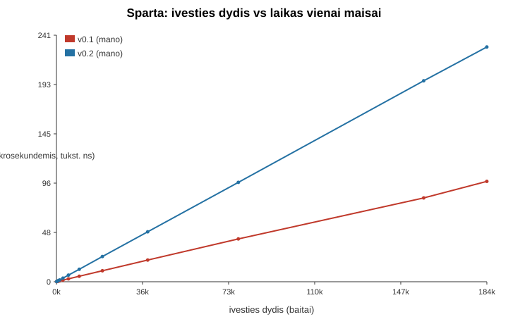
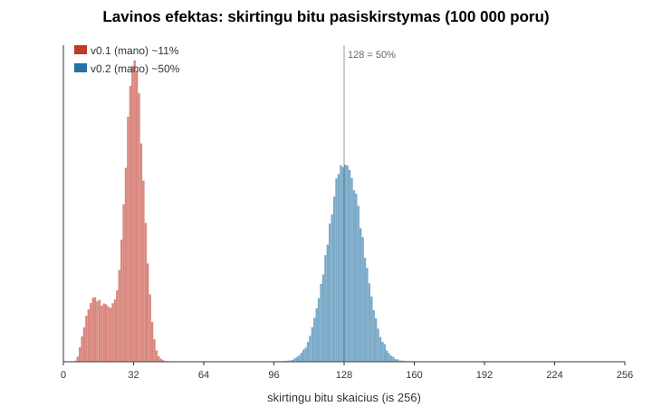
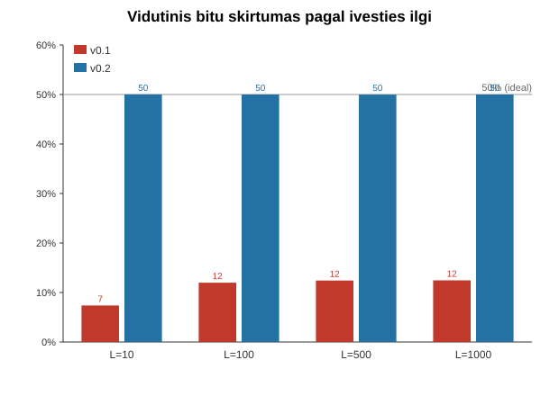

# Maisos generatorius

256 bitu maisos funkcija, parasyta C++ kalba. Programa veikia dviem rezimais: failo
turinio maisa ir ranka ivesto teksto maisa. Yra dvi algoritmo versijos - v0.1 (pradine)
ir v0.2 (patobulinta). Ataskaitoje pateikti 8 eksperimentai ir dvieju versiju palyginimas.

Algoritmas sukurtas nuo nulio, tai nera standartines maisos (SHA-256, MD5 ir pan.)
kopija ar iskvietimas.

## Turinys

1. Kompiliavimas ir paleidimas
2. Naudojimas
3. Ivestis ir isvestis
4. Algoritmas
5. Versiju palyginimas
6. Eksperimentai
7. Isvados
8. Atkuriamumas
9. DI naudojimas
10. Saltiniai

## 1. Kompiliavimas ir paleidimas

Sprendime (`maisa/maisa.sln`) yra du projektai: `maisa` (generatorius) ir `experiments`
(8 eksperimentai). Abu kompiliuojami i bendra `build/` kataloga.

Su Visual Studio: atidaryti `maisa/maisa.sln`, pasirinkti Release / x64, Build > Build
Solution. Paleisti `maisa` (Ctrl+F5) arba `experiments` (Set as Startup Project, tada
Ctrl+F5). `experiments` darbinis katalogas nustatytas i repozitorijos sakni, kad rastu
`data/` ir rasytu i `results/`.

Is komandines eilutes (MSVC):

```
call "C:\Program Files\Microsoft Visual Studio\2022\Community\VC\Auxiliary\Build\vcvars64.bat"
cl /nologo /EHsc /O2 /std:c++17 maisa\maisa\maisa.cpp /Fe:build\maisa.exe
cl /nologo /EHsc /O2 /std:c++17 maisa\experiments\experiments.cpp /Fe:build\experiments.exe
```

Su g++:

```
g++ -O2 -std=c++17 maisa/maisa/maisa.cpp -o build/maisa
g++ -O2 -std=c++17 maisa/experiments/experiments.cpp -o build/experiments
```

Eksperimentu paleidimas ir grafikai (is repozitorijos saknies):

```
python scripts/generate_dataset.py
build\x64\Release\experiments.exe
python scripts/make_plots.py
```

## 2. Naudojimas

```
maisa -f <failas>     maisuoja tikslius failo baitus
maisa -t <tekstas>    maisuoja argumento teksta kaip UTF-8 (be naujos eilutes)
maisa -i              rankinis ivedimas (viena eilute, Enter naujos eilutes neitraukia)
parinktys: --v1 | --v2   (numatyta --v2)
```

Programa isveda maisa (64 hex) ir rezimo informacija. Jei failo perskaityti nepavyksta,
pranesama klaida ir grazinamas kodas 1 (nelaikoma tuscia ivestimi).

Pavyzdys:

```
maisa -t "lietuva"
5ad4a7b0843ec2fb995e82f4d12a7ce8f261284ef2bdb98ca9d4de390da0bf4b
```

## 3. Ivestis ir isvestis

Maisuojami tikslus ivesties baitai. Tekstas is `-t` ir `-i` imamas taip, kaip ji pateikia
terminalas (UTF-8 aplinkoje - UTF-8 baitai). Failo rezimu skaitomi neapdoroti baitai
(binary). Tekstas nenormalizuojamas: nesalinami tarpai, nekeiciamas registras, nekeiciamos
eiluciu pabaigos. Rankiniame rezime `getline` nuima naujos eilutes simboli, todel Enter
sukurtas `\n` neitraukiamas.

Isvestis: 256 bitu = 32 baitai = 64 hex skaitmenys, mazosiomis raidemis, su issaugotais
pradiniais nuliais (kiekvienas is 4 lanku visada rasomas 16 hex skaitmenu).

UTF-8 pavyzdys: `Aciu` su euro zenklu = baitai 41 C4 8D 69 C5 AB E2 82 AC, tai yra 5
simboliai, bet 9 baitai (simboliu skaicius nesutampa su baitu skaiciumi).

Praktine riba: ivestis laikoma atmintyje, todel ja riboja RAM. Dideliems failams reiketu
srautinio skaitymo.

## 4. Algoritmas

Busena - 4 lankai po 64 bitus (h[0..3], is viso 256 bitu), pradedami nuo 4 fiksuotu
nenuliniu konstantu. Kodas: `maisa/maisa/myhash.h`.

### v0.1

```
h[0..3] = fiksuotos konstantos
P = 0x00000100000001B3
kiekvienam baitui b pozicijoje i:
    lane = i mod 4
    h[lane] = (h[lane] XOR b) * P
h[3] = h[3] XOR ilgis
grazinti h[0..3] kaip 64 hex
```

Kiekvienas baitas patenka tik i lanka i mod 4, lankai nesimaiso tarpusavyje. Todel vieno
baito pakeitimas paveikia tik viena is keturiu lanku, ir pasikeicia tik apie ketvirtadalis
isvesties bitu. Tai pasirinkta specialiai, kaip pradinis taskas, kuri veliau galima
pagerinti.

### v0.2

```
h[0..3] = fiksuotos konstantos
P = 0x9E3779B97F4A7C15
kiekvienam baitui b pozicijoje i:
    lane = i mod 4
    h[lane] = h[lane] XOR (b + 1)
    h[lane] = h[lane] * P
    h[lane] = rotl(h[lane], 27)
    h[(lane+1) mod 4] = h[(lane+1) mod 4] XOR h[lane]
kiekvienam lankui k: h[k] = h[k] XOR (ilgis * (2k+1))
3 difuzijos rundos (add, rotl, xor tarp visu 4 lanku)
kiekvienam lankui k: h[k] = fmix64(h[k])
grazinti h[0..3] kaip 64 hex
```

Patobulinimai: lanku maisymas (kiekvienas baitas per kelis zingsnius pasklinda i visus
lankus), ilgio iterpimas i visus lankus, difuzijos rundos ir fmix64 finalizatorius
kiekvienam lankui.

fmix64 naudoja viesas MurmurHash3 fmix konstantas kaip standartini bitu ismaisymo
primityva. Pati 256 bitu konstrukcija (lanku isdestymas, maisymo tvarka, ilgio iterpimas,
difuzija) yra sava.

## 5. Versiju palyginimas

| Versija | Kas prideta | Lavina (bitu vidurkis) | Sparta 184 KB |
|---------|-------------|------------------------|----------------|
| v0.1 | bazine 4 lanku FNV | 11,06 % | 98 446 ns |
| v0.2 | lanku maisymas, ilgis, difuzija, fmix64 | 50,00 % | 230 280 ns |

Abi versijos palygintos tomis paciomis ivestimis ir salygomis.

## 6. Eksperimentai

Visus 8 eksperimentus atlieka `maisa/experiments/experiments.cpp` ir irasomi i `results/`.
Atsitiktiniai skaiciai deterministiniai (fiksuoti seed), todel rezultatai atkuriami.

### 1. Ivestys ir teisingumas

15 atveju: tuscia, po 1 baita, atsitiktinis 2000 baitu ir jo kopijos su pakeistu baitu
(pradzia, vidurys, galas), strukturuoti (pasikartojimai, perstatymai, tarpai, naujos
eilutes) ir UTF-8. Lentele: `results/exp1_inputs.csv`.

v0.1 silpnybe matosi is karto (pakeitus viena baita, keiciasi tik vienas lankas = 16 hex):

| Ivestis | v0.1 maisa |
|---------|------------|
| rand2000 | 32e3a4a2635a4599 3b53407ac898182b d7e8697b11d0f30e 50237d59118dd48b |
| pakeistas 1 baitas | 51ee1060cd9036db 3b53407ac898182b d7e8697b11d0f30e 50237d59118dd48b |
| pakeistas paskutinis baitas | 32e3a4a2635a4599 3b53407ac898182b d7e8697b11d0f30e 50236659118dab96 |

v0.2 kiekvienu atveju maisa pasikeicia visiskai.

### 2. Isvesties formatas

20 is 20 atveju: ilgis lygiai 64 hex, tik hex simboliai, failo ir rankines ivesties
rezultatai sutampa kai baitai vienodi, pradiniai nuliai natūraliai pasitaiko (6 is 20).
Failas: `results/exp2_format.csv`.

### 3. Determinizmas

1000 kartotiniu kvietimu duoda ta pacia maisa. Seka A, B, A: H(A) sutampa abu kartus,
H(A) skiriasi nuo H(B). Maisoje nenaudojamas laikas ar atsitiktinumas. Failas:
`results/exp3_determinism.csv`.

### 4. Sparta

Duomenys: `data/dataset.txt` (184 190 baitu, 1200 eiluciu). Matuotas tik maisos
skaiciavimas (be failo skaitymo), su apsilimu ir 7 matavimu grupemis kiekvienam dydziui.
Rezultatu suma naudojama, kad optimizatorius neismestu skaiciavimu. Pilna lentele:
`results/exp4_speed.csv`.

| Dydis (B) | v0.1 (ns) | v0.2 (ns) |
|-----------|-----------|-----------|
| 87 | 110,1 | 178,7 |
| 1 337 | 797,8 | 1 753 |
| 9 740 | 5 374 | 12 254 |
| 39 056 | 21 252 | 48 996 |
| 184 190 | 98 446 | 230 280 |

Abi versijos tiesines, O(n). Vienam baitui apie 0,5 ns (v0.1) ir 1,2 ns (v0.2). v0.2 apie
du kartus letesne del papildomo maisymo, tai priimtinas kompromisas del geresnes lavinos.



### 5. Kolizijos

Kiekvienam ilgiui 10, 100, 500 ir 1000 sugeneruota po 100 000 poru (abecele ASCII 33-126,
seed = 1000 + ilgis). Tikrinta poromis ir visas kiekvieno ilgio rinkinys (200 000
skirtingu ivesciu), taip pat strukturuoti bandymai. Nerasta nei vienos kolizijos abiem
versijoms. Failas: `results/exp5_collisions.csv`.

Idealiai 256 bitu maisai vienos poros kolizijos tikimybe yra apie 2 pakelta minus 256.
200 000 ivesciu duoda apie 2 kartus 10 pakelta 10 poru, tai nykstamai mazai. Todel
koliziju nerasti yra normalu, ir tai neirodo saugumo. Kolizijos egzistuoja (pagal
pigeonhole principa), tik ju nerandame atsitiktinai.

### 6. Lavinos efektas

Is viso 100 000 poru (po 25 000 keturiems ilgiams). Kiekvienoje poroje pakeistas tiksliai
vienas simbolis. Bitai lyginami dekodavus hex. Failai: `results/exp6_avalanche.csv`,
`results/exp6_bithist.csv`.

| Versija | Bitu skirtumas min / vid / max | Hex skirtumas vid |
|---------|--------------------------------|-------------------|
| v0.1 | 1,95 % / 11,06 % / 19,53 % | 20,83 % |
| v0.2 | 34,77 % / 50,00 % / 63,28 % | 93,75 % |

v0.2 vidurkiai beveik idealus: 50 % bitams ir 93,75 % hex skaitmenims. v0.1 telkiasi ties
apie 11 %, tai patvirtina, kad reaguoja tik ketvirtadalis isvesties.





### 7. Spejimas, druska, slaptas atsitiktinumas

Tiksline ivestis 4242, kandidatai nuo 0000 iki 9999. Failai: `results/exp7_guessing.csv`,
`results/exp7_params.txt`.

| Scenarijus | Bandymai iki pataikymo | Laikas (10 000 kand.) | Sutapimai |
|------------|------------------------|-----------------------|-----------|
| Be druskos H(input) | 4243 | apie 1 ms | 1 |
| Viesa druska H(input, salt) | 4243 | apie 1 ms | 1 |
| Slaptas r: H(input, r), atskleidus r | patikra sekminga | - | - |

Isvados: maza kandidatu erdve (10 000) perrenkama per apie 1 ms, nors isvestys atrodo
atsitiktines. Preimage sunkumas priklauso nuo ivesties erdves, ne nuo maisos isvaizdos.
Viesa druska nekeicia pastangu vienam taikiniui, bet sunaikina is anksto suskaiciuotu
lenteliu panaudojima keliems skirtingu drusku taikiniams. Slaptas r isplecia paieskos
erdve tiek, kad perrinkti nebeimanoma; tai iliustruoja isipareigojimo (commitment) ideja,
bet neirodo saugaus paslepimo. Vien druska nera darbo irodymas (proof-of-work).

## 7. Isvados

Nuo v0.1 iki v0.2 lavina pakilo nuo 11 % iki 50 %, o hex skirtumas nuo 20,8 % iki
93,75 %. Vieno baito pokytis dabar keicia visa isvesti, ne ketvirtadali. v0.2 apie du
kartus letesne uz v0.1, tai kaina uz geresne kokybe.

Silpnybes: konstrukcija nekriptografine, nera saugumo irodymo ir atsparumo analizes.
Tuscios ar labai trumpos ivestys turi mazai difuzijos zingsniu. 0 koliziju ir gera lavina
neirodo atsparumo kolizijoms ar pirmavaizdziui. Galima tureti gera lavina ir vis tiek
leisti lengvai rasti kolizijas, jei egzistuoja strukturine silpnybe, kurios atsitiktiniai
testai nepagauna.

Rysys su paskaita: determinizmas, efektyvumas, preimage ir collision atsparumas, avalanche,
pigeonhole ir birthday, hiding ir commitment, puzzle-friendliness.

## 8. Atkuriamumas

Abecele: ASCII 33-126 (94 spausdinami simboliai, be tarpo).
Seed: 1 eksp. 12345; 5 eksp. 1000 + ilgis; 6 eksp. 5000 + ilgis + versija * 100000;
7 eksp. druska seed 2026, slaptas r seed 999. Duomenu failas: seed 2026.
Imtys: kolizijos 100 000 poru keturiems ilgiams; lavina 100 000 poru.
Duomenu rinkinys: `data/dataset.txt` sukuriamas `scripts/generate_dataset.py`.
Aplinka: AMD Ryzen 9 9950X, 64 GB RAM, Windows 10, MSVC 19.42 (Visual Studio 2022),
C++17, /O2. Pradiniai rezultatai issaugoti `results/`.

## 9. DI naudojimas

v0.1 - pradine ideja ir realizacija (4 lanku FNV konstrukcija). v0.2 - patobulinta versija
(lanku maisymas, ilgio iterpimas, fmix64 finalizacija), pakelusi lavina nuo 11 % iki 50 %.
Naudoti DI irankiai ir priimti / atmesti pasiulymai aprasomi cia; visi skaiciai gauti
realiai paleidus koda.

## 10. Saltiniai

NIST: Hash Functions.
RFC 9106: Argon2 (slaptazodziu maisos kontekstas, sioje uzduotyje nerealizuojamas).
MurmurHash3 fmix64 finalizatoriaus konstantos (viesos), naudotos kaip standartinis
bitu ismaisymo primityvas.
